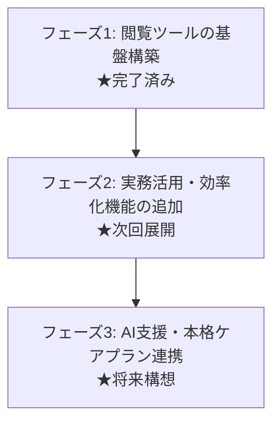

# 適切なケアマネジメント手法項目一覧表（ケアプランAI）プロジェクト計画書

---

## 1. プロジェクト概要

### 1.1 背景と目的
介護保険制度において、自立支援に資するケアマネジメントの質の向上を目指し、厚生労働省により「適切なケアマネジメント手法」が策定されています。  
しかし、各疾患・状態ごとに多数のPDFファイルに分かれており、日々の業務（課題分析・ケアプラン原案作成・モニタリング・サービス担当者会議）の中で素早く参照することが難しいという課題があります。

本プロジェクト**「ケアプランAI（適切なケアマネジメント手法項目一覧表）」**は、全9テーマの膨大な手引き・一覧データを1つの使いやすいWebツールとして統合し、PC・タブレット・スマートフォンから誰でも直感的に参照・活用できる環境を提供することを目的としています。

### 1.2 基本方針
- **使いやすさの追求**: 非エンジニアや現場のケアマネジャーが迷わず操作できるシンプルなUI/UX。
- **完全再現と信頼性**: 厚生労働省が公表する「適切なケアマネジメント手法」の階層構造（基本方針・大項目・中項目・小項目・想定される支援内容）と専門職連携情報を正確に反映。
- **コストゼロ運用**: サーバー代や維持管理費用が一切かからない静的Web技術（HTML/CSS/JavaScript）を採用し、永続的に無料公開・運用可能な仕組みを構築。

---

## 2. 収録データ一覧（対象範囲）

厚生労働省策定の全9テーマ（全PDFデータ）を網羅：

| 番号 | テーマ名 | 対象ステージ・区分 | 主な内容 |
| :---: | :--- | :--- | :--- |
| 1 | 基本ケア | 全般（共通基盤） | 自立支援、尊厳保持、生活機能維持、多職種協働 |
| 2 | 脳血管疾患 Ⅰ期 | 急性期〜回復期 | 退院直後の生活再建、再発予防、リハビリ継続 |
| 3 | 脳血管疾患 Ⅱ期 | 生活期（維持期） | 長期的な生活機能維持、社会参加、家族支援 |
| 4 | 大腿骨頸部骨折 Ⅰ期 | 術後・退院直後 | 転倒予防、早期歩行・起居動作の自立支援 |
| 5 | 大腿骨頸部骨折 Ⅱ期 | 生活期 | 再骨折予防、家事・屋外歩行、住環境の継続整備 |
| 6 | 心疾患 Ⅰ期 | 退院直後・急性期後 | 心不全増悪予防、バイタル・体重管理、活動量調整 |
| 7 | 心疾患 Ⅱ期 | 安定期・維持期 | 再発・増悪防止、服薬管理、社会参加の継続 |
| 8 | 認知症 | 全期 | BPSD対応、本人の意思尊重、介護家族の負担軽減 |
| 9 | 誤嚥性肺炎の予防 | 全期 | 口腔ケア、摂食嚥下機能評価、食事形態・姿勢調整 |

---

## 3. 開発フェーズとロードマップ

### 【フェーズ1】項目一覧閲覧ツールの基盤構築（完了済み）
- [x] **ブランドデザイン策定**: 「ケアプランAI」のロゴ・ヘッダーデザイン構築
- [x] **全9シートのタブ切り替え**: タブ操作によるスムーズなテーマ切替
- [x] **概要版テーブルの忠実再現**: PDF2ページ目の階層表（動的セル結合）
- [x] **スライド詳細パネル**: 想定される支援内容のタップで詳細（支援概要・必要性、アセスメント項目、モニタリング項目、相談専門職）を右側から表示
- [x] **レスポンシブ対応**: PC・タブレット（横向き/縦向き）・スマホでの表示最適化
- [x] **利用上の注意・免責事項モーダル**: 制度変更や著作権・出典に関する法的留意事項の明記
- [x] **完全無料ホスティング対応**: GitHub Pages / Vercel / ローカル単体起動対応

---

### 【フェーズ2】実務活用・効率化機能の追加（短期〜中期計画）
現場のケアマネジャーがケアプラン作成実務でより便利に使えるように、以下の機能を追加実装します。

1. **キーワード全文検索・絞り込み機能**
   - 画面上部に検索バーを設置。
   - 「入浴」「服薬」「誤嚥」「転倒」などの単語を入力すると、全シートまたは現在シートから該当項目を瞬時に抽出。
2. **お気に入り・チェックリスト機能**
   - 項目ごとに「チェック」ボタンまたは「★」マークを配置。
   - 担当している特定の利用者向けに検討した支援項目を一時保存・一覧化。
3. **ケアプラン文言生成・クリップボードコピー機能**
   - チェックした支援項目やアセスメント項目を、ケアプラン第2表（生活全般の解決すべき課題、目標、サービス内容）の原案テキストとしてワンクリックでコピー可能にする。
4. **印刷・PDF出力最適化**
   - 選択した項目一覧を、サービス担当者会議や多職種連携時の配信用資料としてA4用紙1〜2枚に綺麗に印刷できる専用レイアウト。
5. **PWA（Progressive Web Apps）化（オフライン利用対応）**
   - 電波の届きにくい訪問先や利用者宅でも、スマホやタブレットのホーム画面からアプリ感覚で即座に起動・利用可能にする。

---

### 【フェーズ3】AI連携・本格ケアプラン作成支援（長期構想）
「ケアプランAI」の名称にふさわしい、高度な支援機能を構想しています。

1. **アセスメント情報からの手法自動レコメンド**
   - 利用者の基本情報（病名、介護度、現在の困りごと、ADLの自立度）を入力・選択すると、適切なケアマネジメント手法の中から「今アセスメントすべき項目」「推奨される支援」をAIが自動提案。
2. **居宅サービス計画書（1表・2表・3表）の自動下書き作成**
   - 適切なケアマネジメント手法の根拠に基づいた、標準的かつ個別性の高いケアプラン文案をAIが生成。

---

## 4. システム構成・技術選定

| 区分 | 採用技術 | 選定理由 |
| :--- | :--- | :--- |
| **フロントエンド** | HTML5 / Vanilla CSS / Vanilla JavaScript | 外部フレームワークに依存せず、ブラウザ単体で軽量・超高速に動作。保守が容易。 |
| **アイコン** | FontAwesome 6 (CDN) | 直感的で視認性の高いUIアイコン表現。 |
| **フォント** | システム標準フォント + Noto Sans JP | 文字化けを防ぎ、印刷・画面表示ともに美しい日本語表示を実現。 |
| **データ構造** | `data.js` (JavaScript Object) | サーバーやデータベースとの通信遅延がゼロ。オフライン環境でも瞬時に表示可能。 |
| **ホスティング環境** | GitHub Pages または Vercel / Netlify | **費用：完全無料（0円）**。 世界最高水準のCDNによる高速配信と高可用性を実現。 |

---

## 5. 公開・運用手順

### 5.1 Web公開（推奨：GitHub Pages）
1. 本フォルダ内の全ファイルを GitHub のリポジトリへ登録（プッシュ）。
2. リポジトリの **[Settings]** > **[Pages]** を開く。
3. Source を **`Deploy from a branch`**、Branch を **`main` / `/ (root)`** に設定して **[Save]**。
4. 約2〜3分で公開URL（`https://<ユーザー名>.github.io/<リポジトリ名>/`）が自動生成され、誰でもブラウザから利用可能になります。

### 5.2 オフライン・施設内PCでの利用
- インターネット公開を行わない場合でも、フォルダ内の `index.html` をダブルクリックするだけで、一般的なブラウザ（Chrome, Edge, Safari等）で即座に完全動作します。

---

## 6. 法的配慮・免責事項
- **出典**: 本ツールに収録している項目・文章は、厚生労働省が公表している「適切なケアマネジメント手法」の報告書および手引きに基づいています。
- **免責**: 本ツールはケアマネジメント業務の参考・学習ツールであり、介護報酬の請求や個別利用者の安全性・有効性を法的に保証するものではありません。実際のプラン作成においては、主治医や多職種との協議の上、個々の状況に合わせて判断する必要があります。

---

## 7. 今後のマイルストーン

| 目標時期 | 内容 | 状況 |
| :--- | :--- | :---: |
| **2024年3月** | 全9テーマのデータ化、基本UI設計、詳細スライドパネル実装 | **完了** |
| **2024年4月** | キーワード全文検索機能の実装、PWA対応（オフライン動作） | 計画中 |
| **2024年5月** | 項目チェックリスト機能、クリップボード一括コピー機能の実装 | 計画中 |
| **2024年夏以降**| ケアプラン文案生成AIとのAPI連携検証、多職種連携シート印刷機能 | 構想中 |
